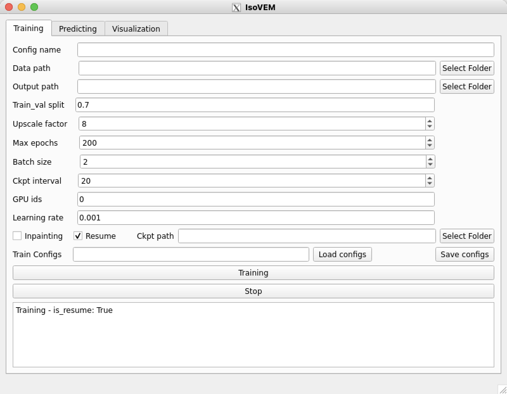
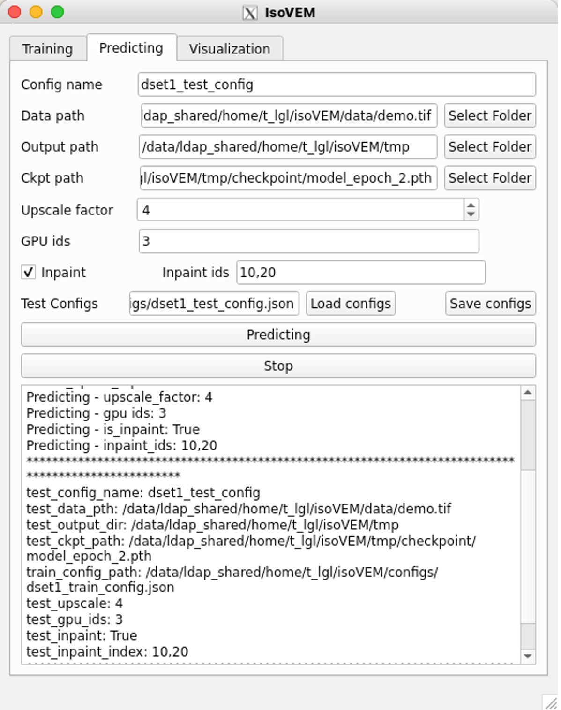
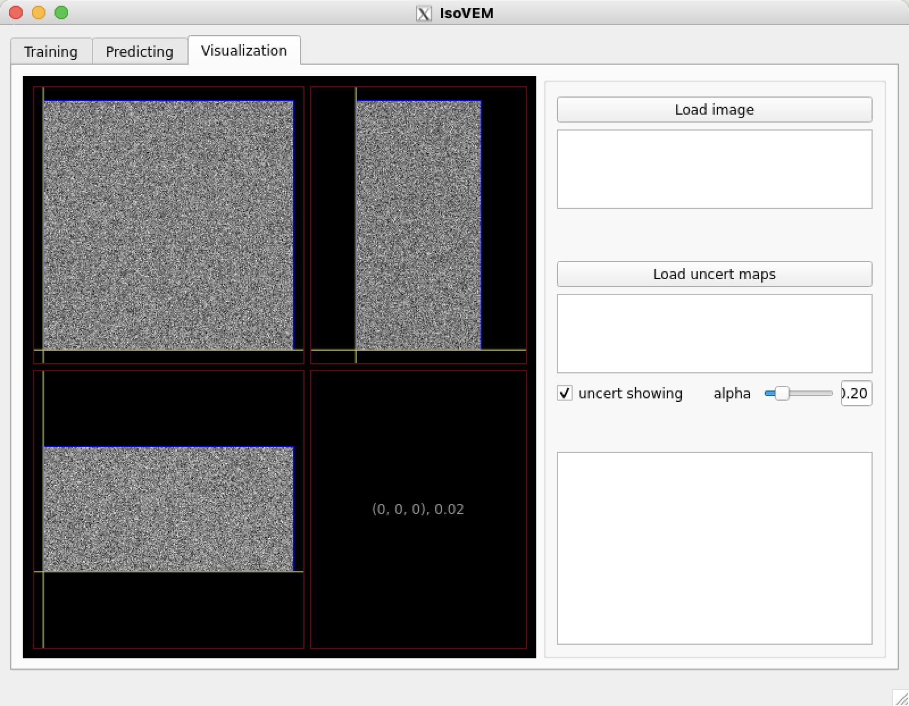

# **IsoVEM: Accurate and Robust Isotropic Reconstruction for Volume Electron Microscopy Using a Video Transformer**

This repository `IsoVEM` is the official implementation of the bioRxiv paper(https://www.biorxiv.org/content/10.1101/2023.11.22.567807v3).

## Usage

#### 1.Install dependencies

Here's a summary of the key dependencies.

- python 3.8.3
- pytorch 1.8.1
- CUDA 11.1

We recommend the following demand to install all of the dependencies.

```
conda create -n isovem -c conda-forge python=3.8.3 -y
conda activate isovem
pip install torch==1.8.1+cu111 torchvision==0.9.1+cu111 torchaudio===0.8.1 pytorch_msssim==1.0.0 -f https://download.pytorch.org/whl/torch_stable.html
pip install -i https://pypi.tuna.tsinghua.edu.cn/simple -r requirements.txt
```

The typical install time for these packages is within half hour.

- **if using GUI**
	
	To use GUI packages with Linux, you will need to install the following extended dependencies for Qt. 
	1. For `CentOS`, to install packages, please do:
		```bash
		sudo yum install -y mesa-libGL libXext libSM libXrender fontconfig xcb-util-wm xcb-util-image xcb-util-keysyms xcb-util-renderutil libxkbcommon-x11
		```

	2. For `Ubuntu`, to install packages, please do:
		```bash
		sudo apt update
		sudo apt-get install -y libgl1-mesa-glx libglib2.0-dev libsm6 libxrender1 libfontconfig1 libxcb-icccm4 libxcb-image0 libxcb-keysyms1 libxcb-render-util0 libxcb-shape0 libxcb-xinerama0 libxcb-xkb1 libxkbcommon-x11-dev libdbus-1-3
		```

#### 2.Model Training

The predefined config files are provided in`configs/demo_train.json` . The meaning of each argument has been annotated as follows. You can also define a new config file as needed. 

```
"train_data_pth":"data/demo.tif" # str, input anisotropic data path. tif or h5 is supported.default "data/demo.tif".
"train_output_dir":"train" # str, output work dir, including /ckpt, /tblogger, /visuals, etc. default "train".
"train_data_split":0.7 # float from 0-1, the percent of training data in the input data. default 0.7.
"train_upscale":8 # int, scale factor during training, supporting 8 and 10 now. default 8.
"train_inpaint":false # bool, whether model learning slice inpainting jointly, default False.
"train_epoch":200 # int, number of training epoch, default 200.
"train_bs":2 # int, batch size for training, default 2.
"train_lr":1e-3 # float, learning rate for training, default 1e-3.
"train_ckpt_interval":1 # int, epoch interval for saving checkpoints, default 1.
"train_is_resume":false # bool, whether training model from a pretrained checkpoint. defaule False.
"train_resume_ckpt_path":null # str, training model from resume checkpoint. default null.
"train_gpu_ids":"0" # str, ids of available gpu card. supporting single card now. default "0".
```

Usually, it is recommended to training model with batch size=2 on graphics cards ranging from 12GB to 24GB. If running on graphics cards smaller than 12GB, consider reducing the batch size<=2.

Model training supports two methods, one is command line and the other is GUI.

(1) Command line:   

Isotropic reconstruction training without slice inpainting: 

```
python train.py --train_config_path configs/demo_train.json
```

Isotropic reconstruction training with slice inpainting: 

```
python train.py --train_config_path configs/demo_train_inpaint.json
```

(2) GUI:



The typical training time for demo data costs several hours.

The training process will generate following files in the work directory:


You can observe training loss by three ways: GUI, tensorboard, and csv file. Note that "loss_metric.csv" has 6 colums, #0-train loss, #1-train l1 loss, #2-train ssim loss, #3-null，#4-validation ssim, #5-validation psnr. 


#### 3.Model Testing

The predefined config files are provided in`configs/demo_test.json` . The meaning of each argument has been annotated as follows. You can also define a new config file as needed. 

```
"test_data_pth": "data/demo.tif"  # str, input anisotropic data path.
"test_ckpt_path": "train/checkpoint/model_epoch_1.pth"  # str, pretrained model path for testing.
"test_output_dir": "test" # str, output work dir, including /result, etc.
"test_upscale": 8  # int, scale factor during testing (it can be different from training phase), default 8.
"test_inpaint": true  # bool, whether perform inpainting during testing.
"test_inpaint_index":  [20,40] # list, the list of slice index (start from 0) along Z-axis to be inpainted. If no need for inpainting, set []. default [].
"test_gpu_ids": "0" # str, ids of available gpu card. supporting single card now. default "0".
```

Model testing supports two methods, one is command line and the other is GUI.

(1) Command line: 

Isotropic reconstruction predicting without slice inpainting: 

```
python train.py --train_config_path configs/demo_test.json
```

Isotropic reconstruction predicting with slice inpainting: 

```
python train.py --train_config_path configs/demo_test_inpaint.json
```

(2) GUI:



The typical testing time for demo data costs within 1 hour.

#### 4.Image Visualization

The GUI provides image visualization function. It is convenient to determine the slice index of the input data that needs inpaint, and you can view the reconstruction results immediately after the reconstruction is completed. The reconstruction results can be overlayed with uncertainty map.



#### 5.More Data Availabity

The vEM datasets used in our paper are mostly public (EPFL, Cremi, GrayMatter) except one customized Sperm dataset. To prosper research in the field of VEM, we release the Sperm dataset on ZENODO website (https://zenodo.org/records/12748945).

## Acknowledgement

The network code is based on [VRT(Video Restoration Transformer)](https://arxiv.org/abs/2201.12288) and its official [implementation](https://github.com/JingyunLiang/VRT/tree/main). We thank the authors for their work and for sharing the code.

## Citation

If you find this repository useful in your research, please cite our paper:

```
@article {He2023.11.22.567807,
	author = {Jia He and Yan Zhang and Wenhao Sun and Ge Yang and Fei Sun},
	title = {IsoVEM: Isotropic Reconstruction for Volume Electron Microscopy Based on Transformer},
	elocation-id = {2023.11.22.567807},
	year = {2023},
	doi = {10.1101/2023.11.22.567807},
	publisher = {Cold Spring Harbor Laboratory},
	URL = {https://www.biorxiv.org/content/early/2023/12/27/2023.11.22.567807},
	eprint = {https://www.biorxiv.org/content/early/2023/12/27/2023.11.22.567807.full.pdf},
	journal = {bioRxiv}
}
```
