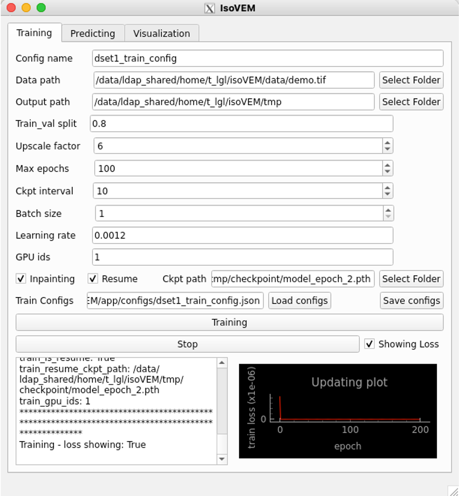
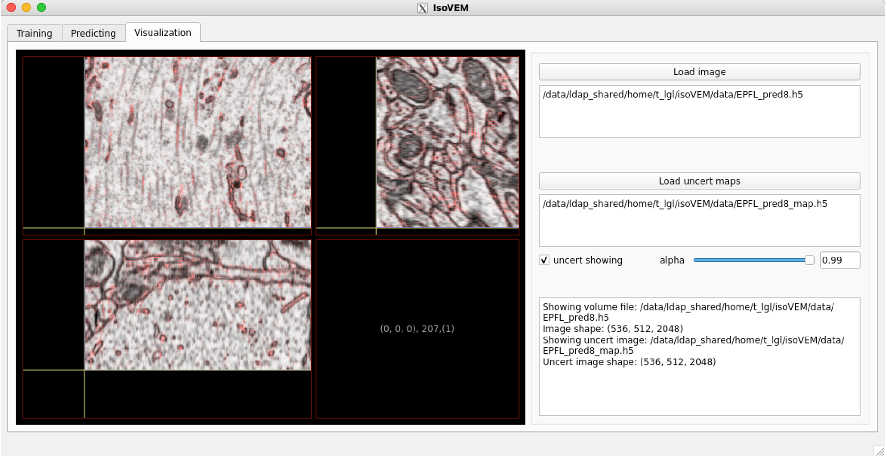

# **IsoVEM: Accurate and Robust Isotropic Reconstruction for Volume Electron Microscopy Using a Video Transformer**

This repository `IsoVEM` is the official implementation of our paper "Accurate and Robust Isotropic Reconstruction for Volume Electron Microscopy Using a Video Transformer", previously submitted on the bioRxiv website (https://www.biorxiv.org/content/10.1101/2023.11.22.567807v3).

IsoVEM is a deep learning-based method for robust high-resolution high-fidelity isotropic reconstruction of vEM images. It utilizes a video Transformer to capture and maintain long-distance cross-slice structural continuity, achieving stable and accurate isotropic reconstruction even under very high anisotropy. It is self-supervised so that no prior isotropic training data is required. It can be configured to repair slice defects jointly with isotropic reconstruction for real-world applications. IsoVEM has excellent generalization capability and outperforms competing state-of-the-art methods on five datasets of four vEM modalities. It is provided in open source with a user-friendly interface to support applications of different vEM modalities. 

## Usage

#### 1. Install dependencies

 The conda environment must be set up. Please visit the official website and follow their instructions for anadonda installation: https://www.anaconda.com/

We recommend the following demand to install all of the dependencies. The critical dependencies are python 3.8.3, pytorch 1.8.1 and CUDA 11.1.

```
$ conda create -n isovem python=3.8.3
$ conda activate isovem
$ pip install torch==1.8.1+cu111 torchvision==0.9.1+cu111 torchaudio===0.8.1 pytorch_msssim==1.0.0 -f https://download.pytorch.org/whl/torch_stable.html
$ git clone https://github.com/cbmi-group/IsoVEM.git
$ cd IsoVEM
$ pip install -i https://pypi.tuna.tsinghua.edu.cn/simple -r requirements.txt
```

The typical installation time for these packages is within half an hour.

- **If using GUI**
	
	To use GUI packages with Linux, you must install the following extended dependencies for Qt. 
	1. For `CentOS`, to install packages, please do:
		```bash
		sudo yum install -y mesa-libGL libXext libSM libXrender fontconfig xcb-util-wm xcb-util-image xcb-util-keysyms xcb-util-renderutil libxkbcommon-x11
		```

	2. For `Ubuntu`, to install packages, please do:
		```bash
		sudo apt update
		sudo apt-get install -y libgl1-mesa-glx libglib2.0-dev libsm6 libxrender1 libfontconfig1 libxcb-icccm4 libxcb-image0 libxcb-keysyms1 libxcb-render-util0 libxcb-shape0 libxcb-xinerama0 libxcb-xkb1 libxkbcommon-x11-dev libdbus-1-3
		```

#### 2. Preparing Data

- ##### Data Requirements


The data needs to have been pre-aligned, and poor alignment may affect the isotropic super-resolution performance. 

If the 3D volume is too large, it needs to be cropped into sub-blocks, such as dividing 1/2 along the XYZ axis to obtain 8 sub-blocks, predicting each sub-block separately, and then stitching them together.

- ##### Demo Data

The demo data `data/demo.tif` are cropped from the public [EPFL dataset](https://www.epfl.ch/labs/cvlab/data/data-em/) under 8-fold simulated anisotropic degradation. The demo data `data/demo_debris.tif` are then randomly replaced slices into black to simulate slice debris.

- **Sperm Data Availability** 

The vEM datasets used in our paper are mostly public ([EPFL](https://www.epfl.ch/labs/cvlab/data/data-em/), [Cremi](https://cremi.org/data/), [GrayMatter](https://etsin.fairdata.fi/ )) except for one customized Sperm dataset. To promote research in the field of VEM, we released the Sperm dataset on the ZENODO website (https://zenodo.org/records/12748945).

#### 3.Model Training

- ##### Training Configuration

The predefined config files are provided in `configs/demo_train.json` (isotropic super-resolution) and `configs/demo_train_inpaint.json` (joint isotropic super-resolution and slice recovery). You can also define a new config file as needed. 

The meaning of each argument has been annotated as follows: 

```
"train_data_pth":"data/demo.tif" # str, input anisotropic data path. tif or h5 is supported.default "data/demo.tif".
"train_output_dir":"train" # str, output work dir, including /ckpt, /tblogger, /visuals, etc. default "train".
"train_data_split":0.7 # float from 0-1, the percent of training data in the input data. default 0.7.
"train_upscale":8 # float, scale factor during training, supporting integers or decimals from 2-12. default 8.
"train_inpaint":false # bool, whether model learning slice inpainting jointly, default False.
"train_epoch":200 # int, number of training epoch, default 200.
"train_bs":2 # int, batch size for training, default 2.
"train_lr":1e-3 # float, learning rate for training, default 1e-3.
"train_ckpt_interval":1 # int, epoch interval for saving checkpoints, default 1.
"train_is_resume":false # bool, whether training model from a pretrained checkpoint. defaule False.
"train_resume_ckpt_path":null # str, training model from resume checkpoint. default null.
"train_gpu_ids":"0" # str, ids of available gpu card. supporting single card now. default "0".
```

- ##### Lauch Model Training

Launch model training supports two methods: one is the command line, and the other is GUI.

(1) Command line:   

Isotropic reconstruction training without slice inpainting: 

```
python train.py --train_config_path configs/demo_train.json
python train.py --train_config_path configs/demo_train_decimal.json
```

Isotropic reconstruction training with slice inpainting: 

```
python train.py --train_config_path configs/demo_train_inpaint.json
```

(2) GUI:
Launch the GUI interface: 

```
python main.py
```

Then go to the "Training" part, and press "Load configs" button to load the predefined config files  `configs/demo_train.json` or `configs/demo_train_inpaint.json`. To customize the configuration, fill in the fields above the "Load configs" button to generate and save a new configuration file. 



After that, press "Training" button to begin model training. The interface will show the training process on the command line and the training loss plot. During training, it will generate the following files in the working directory. 


If the training loss converges, press the "Stop" button to terminate the training process. You can observe training loss in three ways: GUI, tensorboard, and "loss_metric.csv" file. Note that "loss_metric.csv" has 6 colums, #0-train loss, #1-train l1 loss, #2-train ssim loss, #3-null，#4-validation ssim, #5-validation psnr. 

Training the model with batch size=2 on graphics cards ranging from 12GB to 24GB is usually recommended. If running on graphics cards smaller than 12GB, consider reducing the batch size=1. The typical training time for demo data costs several hours. 

- ##### Pretrained Checkpoint

We provide the pre-trained IsoVEM model weights of **EPFL-8-IsoSR** and **EPFL-8-Inpaint** at `pretrain/EPFL_8_IsoSR_196.pth` and `pretrain/EPFL_8_Inpaint_206.pth` respectively. They were trained on the public [EPFL dataset](https://www.epfl.ch/labs/cvlab/data/data-em/) under 8-fold simulated anisotropic degradation, respectively in isotropic super-resolution mode and joint slice inpainting mode.

#### 4. Model Testing

- ##### Testing Configuration

The predefined config files are provided in `configs/demo_test.json` (isotropic super-resolution) and `configs/demo_test_inpaint.json` (joint isotropic super-resolution and slice recovery). You can also define a new config file as needed. 

The meaning of each argument has been annotated as follows: 

```
"test_data_pth": "data/demo.tif"  # str, input anisotropic data path.
"test_ckpt_path": "train/checkpoint/model_epoch_1.pth"  # str, pretrained model path for testing.
"test_output_dir": "test" # str, output work dir, including /result, etc.
"test_upscale": 8  # float, scale factor during testing (it can be different from training phase), default 8.
"test_inpaint": true  # bool, whether perform inpainting during testing.
"test_inpaint_index":  [20,40] # list, the list of slice index (start from 0) along Z-axis to be inpainted. If no need for inpainting, set []. default [].
"test_gpu_ids": "0" # str, ids of available gpu card. supporting single card now. default "0".
```

- ##### Lauch Model Testing

Launch model testing supports two methods: one is the command line, and the other is GUI.

(1) Command line: 

Isotropic reconstruction predicting without slice inpainting: 

```
python test.py --test_config_path configs/demo_test.json
python test.py --test_config_path configs/demo_test_decimal.json
```

Isotropic reconstruction predicting with slice inpainting: 

```
python test.py --test_config_path configs/demo_test_inpaint.json
```

(2) GUI:

Launch the GUI interface: 

```
python main.py
```

Then go to the "Predicting" part, and press "Load configs" button to load the predefined config files  `configs/demo_test.json` or `configs/demo_test_inpaint.json`. To customize the configuration, fill in the fields above the "Load configs" button to generate and save a new configuration file. 


After that, press "Predicting" button to begin model testing. The interface will show the inference process on the command line. 

Testing the model is usually recommended running on graphics cards about 12GB. The typical testing time for demo data costs within 1 hour. Usually, the "inpainting" mode is slightly slower than the isotropic super solution mode because the additional slice recovery step.

#### 5. Image Visualization

The GUI also provides a 3D vEM image visualization function. It is convenient to determine the slice index of the input data that needs to be inpainted. Besides, you can view the reconstruction results immediately after the reconstruction is finished, which can be overlayed with its uncertainty map.



## Acknowledgment

The network code is based on [VRT(Video Restoration Transformer)](https://arxiv.org/abs/2201.12288) and its official [implementation](https://github.com/JingyunLiang/VRT/tree/main). We thank the authors for their work and for sharing the code.

## Citation

If you find this repository useful in your research, please cite our paper:

```
@article {He2023.11.22.567807,
	author = {Jia He and Yan Zhang and Wenhao Sun and Ge Yang and Fei Sun},
	title = {IsoVEM: Isotropic Reconstruction for Volume Electron Microscopy Based on Transformer},
	elocation-id = {2023.11.22.567807},
	year = {2023},
	doi = {10.1101/2023.11.22.567807},
	publisher = {Cold Spring Harbor Laboratory},
	URL = {https://www.biorxiv.org/content/early/2023/12/27/2023.11.22.567807},
	eprint = {https://www.biorxiv.org/content/early/2023/12/27/2023.11.22.567807.full.pdf},
	journal = {bioRxiv}
}
```
